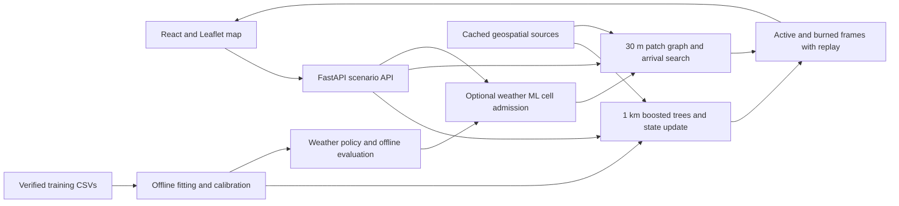

**Wildfire Atlas: exploring how wildfires could spread**

Wildfire Atlas combines satellite detections, terrain, vegetation and roads in
an interactive wildfire spread explorer: place a fire or load NASA FIRMS
detections, run a simulation, and inspect the results.

Explore Colorado and Alberta, inspect vegetation, replay frames and compare
historical satellite observations. Active and burned fuel remain distinct.

The data has specific roles in training and simulation:

| Data source | What we extract | Where it is used |
| --- | --- | --- |
| NASA FIRMS VIIRS: Suomi NPP, NOAA-20 and NOAA-21 | Detections, brightness, counts and age | Learned inputs, ignition seeds and historical comparisons; live observations must be 3–24 hours old. |
| FEDS burned-area snapshots | Whether a candidate cell newly burns over the next 12 hours | Satellite-derived training/evaluation labels, with imperfect coverage. |
| NOAA ETOPO 2022 terrain | Elevation, slope, aspect and coverage flags | Learned 1 km model; CSV lookup or retained terrain blocks. |
| NALCMS 2020 v2 land cover, 30 m | Forest, grass, shrub, water and other mapped classes | Polygon fuel patches, coarse fuel-duration rules and water exclusion. |
| NASA MOD44B vegetation cover | Tree/non-tree cover and quality flags | Vegetation inspector and coarse fuel-duration estimates where supported. |
| Overture Maps roads, US/Canada release 2026-08-19.0 | Geometry, width and surface | Polygon barriers; not predictors in the learned model. |
| Natural Earth land/water geometry | Generalized coastlines and lakes | Coarse barriers, supplemented by native land-cover water measurements. |
| Open-Meteo ECMWF IFS analysis and forecasts | Temperature, humidity, rain, wind and six-hour history | Weather-model training/evaluation and optional weather ML polygon simulation. |

The verified CSV release covers **May 11–August 22, 2026 source snapshots**:
500,364 candidate examples across eight tables totaling about **4.17 GB**.
Each example is one 1 km cell at one prediction origin; tables join by example ID.
Static sources have their own vintages. Vegetation and landscape CSVs preserve
research evidence but are not fitted inputs to the current classifier.

The application has a learned cell engine, a polygon engine and a hybrid mode:

- **Learned 1 km engine:** a scikit-learn `HistGradientBoostingClassifier`, an
  ensemble of decision trees, followed by logistic probability calibration.
  The current fit uses 300 boosting iterations, at most seven leaves per tree,
  and learning rate 0.04, with regularization to limit overfitting.
  Its 13 inputs describe neighboring fire observations in a 3×3 area and terrain.
  It estimates the probability that an unburned candidate newly burns in 12 hours.
  The simulation scores the eight-neighbor frontier, applies a 0.20 eligibility
  threshold and reproducible probability draws, then updates fuel and burned state.
  Simulated active cells supply observation-like inputs for subsequent steps.
  Vegetation governs burnout through explicit rules outside the fitted classifier.
- **Polygon engine:** a deterministic graph-based travel-time simulator.
  Nodes are vegetated pieces of a 30 m mesh cut by road surfaces; edges connect
  patches through traversable shared boundaries. Edge times depend on travel
  distance, configured fuel-specific speeds and wind direction. A resumable
  Dijkstra shortest-path search computes earliest fire arrival times. Each patch
  burns out after its fuel-specific duration, and a front must reach its exit
  before that source patch expires. The engine assumes flat travel; terrain
  slope is not included. Current defaults use zero wind and disable spotting.
  Cached tiles expand as needed, within area/memory budgets and without a time
  cap. Standard mode uses no learned probabilities; the hybrid adds them.
- **Weather policy and optional hybrid:** two calibrated boosted-tree classifiers
  combine fire geometry and weather features. Their probabilities are blended
  as 75% geometry model plus 25% weather model, with a 0.15 decision threshold.
  The hybrid uses this probability to admit new 1 km cells; roads and fuel still
  govern the detailed path. Captured wind affects travel. Fire inputs are rebuilt
  from simulated patches, an experimental transfer from observed training rows.
  Both live forecasts and historical analysis are supported, with pinned weather
  for replay. One representative weather location applies to the whole scenario.

Python engines cache road/vegetation data and reuse graphs and prior search work.

The current fit uses **20,940 eligible frontier training rows** and **3,403
separate calibration rows** from the larger release. Evaluation holds out
incidents, regions and later dates. The learned model's held-incident PR-AUC is
**0.679**; the offline weather blend reaches **0.738** on the same cohort.
These measure one-step classification against satellite-derived labels, not
the accuracy of a simulated multi-day fire perimeter.
Engineering validation includes automated Python/frontend tests and a real-data
browser demonstration of seven days of standard polygon spread and exact replay.

This is a research and education prototype. Detailed spread rates and fuel
durations remain assumptions. Hybrid perimeter accuracy is unvalidated; its
post-forecast continuation holds the last weather constant and labels that
assumption. The app is not validated for emergency decisions.

Details: [model results](model-results.md), [runtime architecture](architecture.md),
[source configuration](providers.md), [weather coupling](weather-polygon.md),
and [fuel/water rules](fuel-and-water.md).
Code: [training](../src/wildfire_data/model/training/public_csv.py),
[learned rollout](../src/wildfire_data/model/spread.py),
[polygon travel](../src/wildfire_data/model/local_spread.py).
